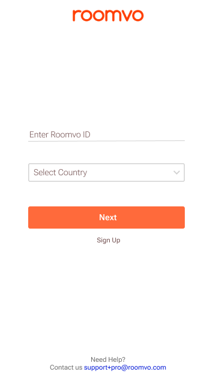
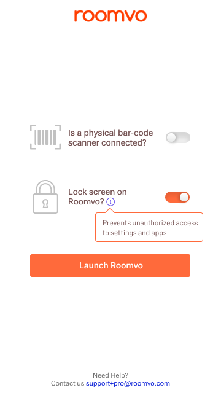

# Roomvo

## This repository demonstrates the initial login and launch flow for the Roomvo app on mobile.

## The initial screen features a user input field for the email ID registered with Roomvo, along with a country selection option and a ‘Next’ button to proceed to the next page. The ‘Next’ button is disabled with a lighter color if the user has not provided the required input details.

## Upon entering the required information and selecting the ‘Next’ button, the user is directed to a second page that features two toggle buttons for bar-code scanning information and user preferences for authentication. After setting their preferences, the user can launch the Roomvo software by selecting the ‘Launch’ button.

## Figma Link
https://www.figma.com/file/NotpOMCvtLGrnVNxrdCS7d/Roomvo?type=design&node-id=0%3A1&mode=design&t=yFdGPTyedZbwev31-1
https://www.figma.com/file/NotpOMCvtLGrnVNxrdCS7d/Roomvo?type=design&node-id=3%3A20&mode=design&t=N3j5jzJ1lYHfxOKw-1

### Icons downloaded from https://www.flaticon.com/free-icons/
